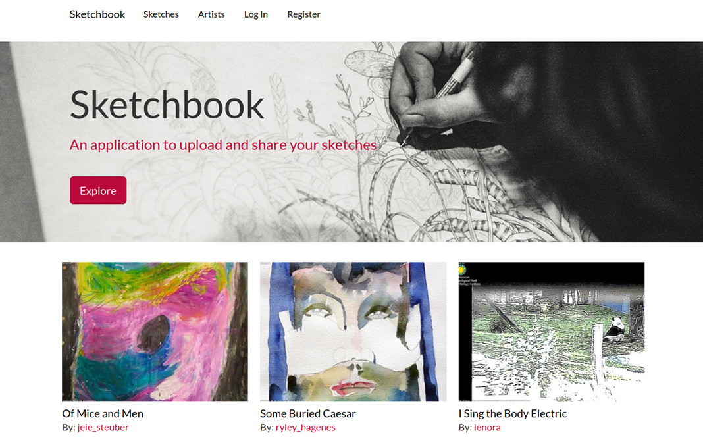

# Sketchbook

Sketchbook is a web application used to help artists manage and share their sketches, and to allow users to search and explore the sketches of others. It is built with an AngularJS front end and a Rails serialized JSON back end.

## Demo App
You can see a demo version of the application deployed to Heroku here: https://angular-sketchbook.herokuapp.com/

## Functionality
Users can create an account, upload images (sketches), and view the sketches of other artists through searching and filtering based on tags. With AngularJS, it works as a single page application and communicates with the back end asynchronously.

## Application Info
- Back end dependencies are handled by [Bundler][bundler] and specified in the [Gemfile][gemfile].
- Front end dependencies are handled by [Yarn][yarn] and [Webpacker][webpacker] and specified in the [package.json][package.json] file.
- Authentication (user registration and login) is handled by the [Rails Devise][devise] gem and implemented in AngularJS with [Angular Devise][angular-devise].
- Image uploading is managed by [Active Storage][active-storage], and facilitated in AngularJS with [ng-file-upload][ng-file-upload]. For production, it's configured to use [AWS S3][s3] to store images.
- Serialization (responding to requests with data converted to JSON) is handled by [Active Model Serializers][active-model-serializers].

## Install Instructions
To get it running in development, install dependencies from the [Gemfile][gemfile] via [Bundler][bundler] by running `bundle install`. Front end dependencies are managed with Yarn. Follow the instructions [here][yarn-getting-started] to install Yarn. Once Yarn is installed, you can install dependencies from the [package.json][package.json] file by running `yarn install`. Styles are included in the [CSS manifest file][css-manifest].

Since the application uses PostgreSQL, you need to have it installed locally on your machine with a user that has table creation privileges. You can get further instructions [here][postgres-local-setup].

Create the database with `bundle exec rails db:create` and run migrations with `bundle exec rails db:migrate`, then run `bundle exec rails db:seed` to populate the database with sample artists and sketches.

For production, the application is configured to use [AWS S3][s3]. You can read more about setting up S3 [here][heroku-s3-setup] (with Heroku).

## Testing
The back end test suite is developed using Rspec via the [rspec-rails gem][rspec-rails] with [shoulda-matchers][shoulda]. Model factories are set up with [FactoryBot][factory-bot].

Rspec tests are located under the [`/spec` directory][spec-directory]. In order to run tests, run `bundle exec rspec` followed by an optional folder or file under the [`/spec` directory][spec-directory] (for example, if you only want to test models, run `bundle exec rspec spec/models`).

## More Info
You can read a blog post going further into the application [here][blog-post].

## License
This project is open source under the terms of the [MIT License][mit].

[bundler]: http://bundler.io/
[gemfile]: https://github.com/MitulMistry/sketchbook/blob/master/Gemfile
[yarn]: https://yarnpkg.com/
[yarn-getting-started]: https://yarnpkg.com/getting-started;
[webpacker]: https://github.com/rails/webpacker
[package.json]: https://github.com/MitulMistry/sketchbook/blob/master/package.json
[devise]: https://github.com/plataformatec/devise
[angular-devise]: https://github.com/cloudspace/angular_devise
[active-storage]: https://github.com/rails/rails/tree/master/activestorage
[ng-file-upload]: https://github.com/danialfarid/ng-file-upload
[s3]: https://aws.amazon.com/s3/
[active-model-serializers]: https://github.com/rails-api/active_model_serializers
[vendor]: https://github.com/MitulMistry/sketchbook/tree/master/vendor/assets/bower_components
[js-manifest]: https://github.com/MitulMistry/sketchbook/blob/master/app/assets/javascripts/application.js
[app-js]: https://github.com/MitulMistry/sketchbook/blob/master/app/assets/javascripts/angular-app/app.js
[css-manifest]: https://github.com/MitulMistry/sketchbook/blob/master/app/assets/stylesheets/application.css
[postgres-local-setup]: https://devcenter.heroku.com/articles/heroku-postgresql#local-setup
[heroku-s3-setup]: https://devcenter.heroku.com/articles/s3
[rspec-rails]: https://github.com/rspec/rspec-rails
[shoulda]: https://github.com/thoughtbot/shoulda-matchers
[factory-bot]: https://github.com/thoughtbot/factory_bot_rails
[spec-directory]: https://github.com/MitulMistry/sketchbook/tree/master/spec
[blog-post]: http://mitulmistry.github.io/javascript/rails/angular-rails-app/
[mit]: http://opensource.org/licenses/MIT
